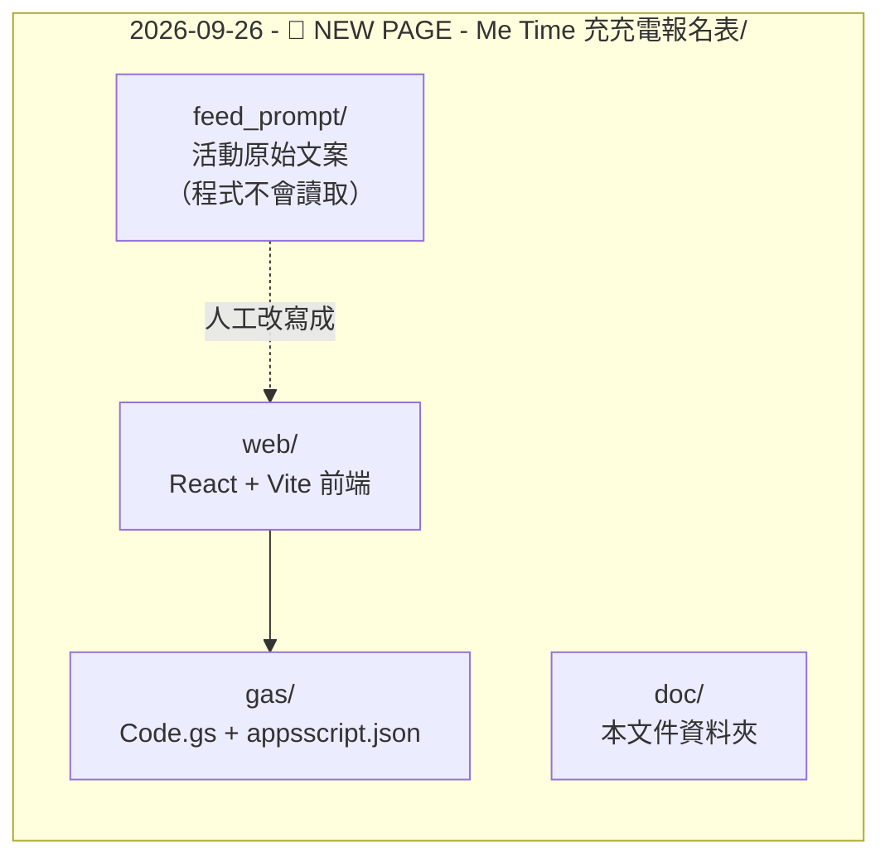

# 文件索引

本資料夾為「Me Time 充充電報名表」的技術文件。

| 文件 | 內容 |
| --- | --- |
| [architecture.md](./architecture.md) | 高層次視圖、模組地圖、建置與部署流程 |
| [api.md](./api.md) | GAS Web App API 契約、請求／回應、錯誤語意 |
| [schema.md](./schema.md) | 表單 schema 結構、欄位型別、試算表欄位對應 |

## 這個資料夾是什麼

一個活動 = 一個資料夾。這個資料夾同時包含「活動內容」與「該活動的網站程式碼」：

- `feed_prompt/` 是 `PROMPT.md` 指定的文案來源，**沒有任何程式讀取它**。要換文案，請改寫成 `web/src/data/` 內的結構化資料（見 [schema.md](./schema.md#內容來源與程式資料的對應)）。
- `gas/` 與 `web/` 是真正會執行的程式碼。
- 新增下一個活動 = 複製整個資料夾並改寫 `web/src/data/` 與 `gas/`。

## 相關文件

- 根目錄 [PROMPT.md](../../PROMPT.md) — 需求規格（權威來源）
- 根目錄 [AGENTS.md](../../AGENTS.md) — 開發與 Git 流程規範
- 根目錄 [README.md](../../README.md) — 設定步驟
