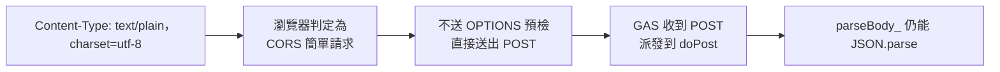
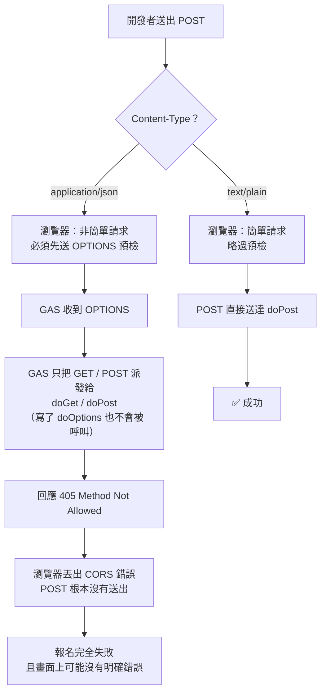
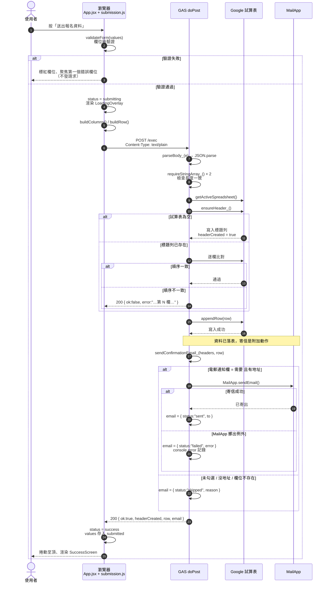
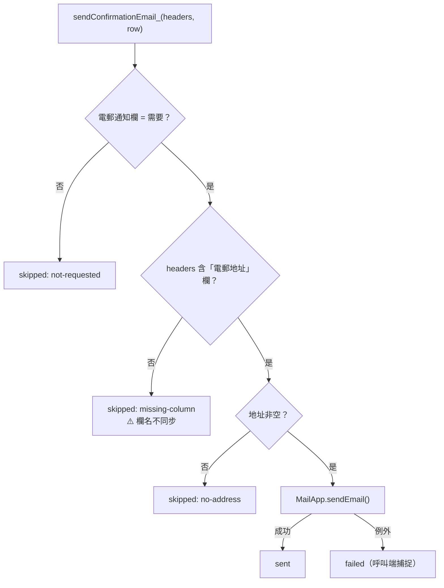
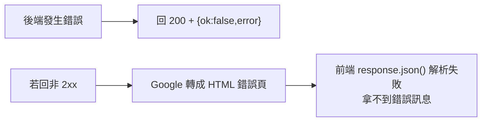
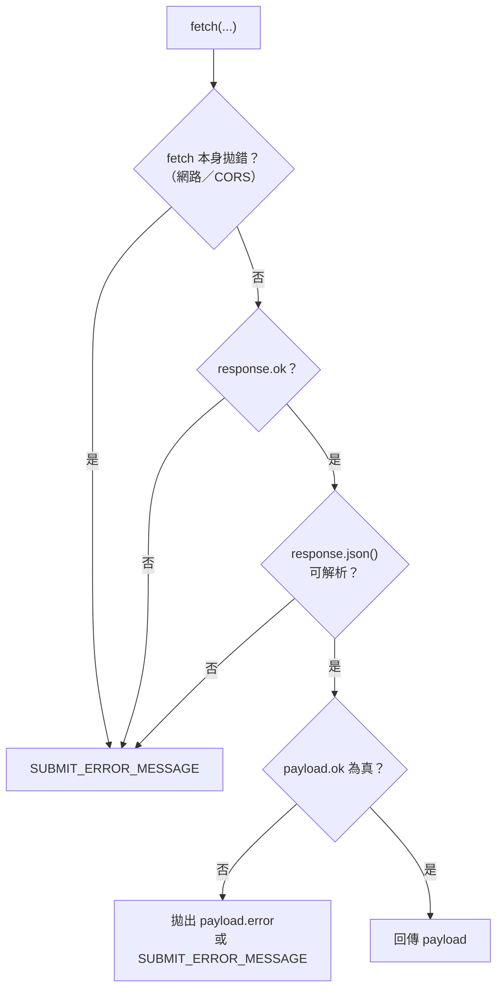
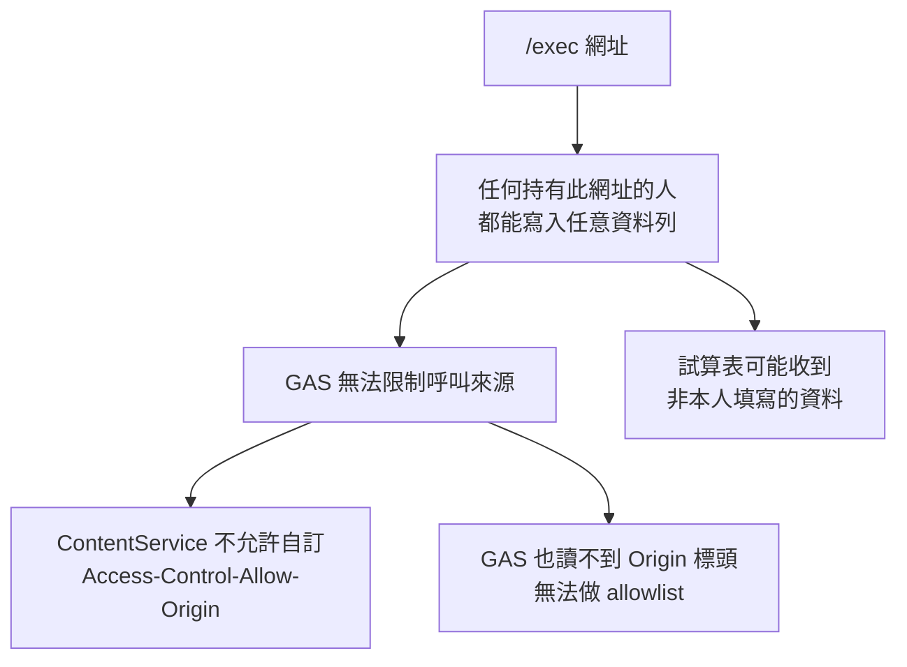

# API

後端是**一個** Google Apps Script Web App，只提供兩個端點。沒有 REST 風格的路徑，兩者都是同一個 `/exec` 網址、以 HTTP method 區分。

| Method | 用途 | 呼叫者 |
| --- | --- | --- |
| `POST` | 寫入一列報名資料 | 報名表單（正式流程） |
| `GET` | 診斷，回報試算表綁定與筆數 | 人工（開瀏覽器確認部署成功） |

## 請求格式

`POST` 的 body **是 JSON 內容，但不是 `application/json`**。這是本專案最容易踩雷的地方。



| 項目 | 值 |
| --- | --- |
| URL | GAS Web App 的 `/exec` 網址（由 `VITE_GAS_API_URL` 注入） |
| Method | `POST` |
| `Content-Type` | `text/plain;charset=utf-8` ← **不可改成 `application/json`** |
| Body | JSON 字串，見下 |

```json
{
  "headers": ["參加者姓名", "聯絡電話", "所屬類別", "…"],
  "row":     ["陳小明", "91234567", "本堂會友", "…"]
}
```

- `headers` 是試算表的標題列，`row` 是資料列，**兩者長度必須相同**。
- 兩者的元素一律是字串（前端已把陣列與物件序列化完畢，見 [schema.md](./schema.md#值的序列化規則)）。
- `headers` 每次都完整送出，因此後端不需要在前端與後端各維護一份欄位定義。

## 為什麼 Content-Type 必須是 text/plain

這是 Google Apps Script 的**硬性限制**，不是 Coding Style 選擇。



結論：**body 內容是 JSON，但宣告的 MIME 類型是純文字。** 後端 `JSON.parse` 一樣解析得動。

## 成功路徑



成功回應：

```json
{
  "ok": true,
  "service": "otc-application-form",
  "headerCreated": false,
  "row": 12,
  "email": { "status": "sent", "to": "chan@example.com" }
}
```

| 欄位 | 意義 |
| --- | --- |
| `ok` | 前端唯一判斷成功與否的依據 |
| `service` | 服務名稱，用於確認打到正確的部署 |
| `headerCreated` | 本次是否建立了標題列（`true` 表示這是第一筆報名） |
| `row` | 寫入後的資料列數，可用於人工抽查 |
| `email.status` | `sent` 已寄出 / `skipped` 未寄（附 `reason`）/ `failed` 失敗（附 `error`） |

## 電郵確認信

`emailNotify`（電郵通知）勾「需要」且 `email` 有值時，`sendConfirmationEmail_()` 會用 `MailApp` 寄一封報名確認信給報名者本人。



設計上的三個決定：

1. **寄信在 `appendRow` 之後。** 報名資料絕不能因為寄信問題而遺失，所以順序是「先落表、再寄信」，寄信失敗仍回 `ok: true`。
2. **寄信失敗不通知前端使用者。** `submitApplication()` 只 `console.warn`，畫面照常顯示報名成功。理由是使用者看到「失敗」很可能會重填一張表單，造成重複報名。實際收信情況要看 Apps Script 執行紀錄。
3. **信件內容寫死在後端。** `EVENT_TITLE` / `ORGANIZER_NAME` / `CONTACT_PHONE` / `CONTACT_PERSON` 是 `Code.gs` 內的常數，不從 payload 取得 —— 否則任何能打到 `/exec` 的人都能改寫寄給報名者的信件內容。

需要留意的限制：

- 寄件人就是這個 Apps Script 專案的執行身分（教堂的 Google 帳號），**無法自訂寄件網域**，報名者會看到該帳號地址。
- 每日寄信額度：一般 Gmail 帳號 100 封、Gmail Workspace 1,500 封。以本活動規模綽綽有餘。
- 欄名不同步是**靜默失敗**：`ensureHeader_()` 不會報錯（標題列本來就一致），只會導致 `skipped: missing-column`。改欄名時務必同步 `Code.gs` 的常數。
- `gas/appsscript.json` 沒有宣告 scope，Apps Script 會在儲存或重新部署時要求授權寄信權限（`https://www.googleapis.com/auth/gmail.send`）。**必須同意**，否則 `MailApp` 會擲出例外（`failed`）。

## 失敗語意

`Code.gs` **永遠回傳 HTTP 200**，失敗以 body 的 `ok: false` 表示。



這是刻意的：Google 會把非 2xx 轉成 HTML 錯誤頁，前端就讀不到具體原因。使用者只會看到「傳送失敗」而無從排查。

常見 `error` 訊息：

| `error` 內容 | 原因 | 處理方式 |
| --- | --- | --- |
| `請求內容為空，請確認前端已正確送出表單資料。` | body 缺漏 | 檢查前端是否真的呼叫 |
| `請求內容不是合法的 JSON。` | body 不是合法 JSON | 檢查是否被中間層改寫 |
| `headers 不可為空` | 送出空標題列 | `formSchema` 的 `column` 被清空 |
| `欄位數量與資料列不符（headers N 欄，row M 欄）` | 前後端不一致 | 通常代表 `buildColumns` 與 `buildRow` 被改動其一 |
| `找不到綁定的試算表，請確認本專案已附加在目標試算表上。` | 不是以容器 bound 建立 | 重新用「擴充功能 → Apps Script」建立 |
| `試算表標題列與表單欄位順序不一致：第 N 欄應為「X」但目前是「Y」` | 改過 schema 但沒重建標題列 | 清空試算表或修正標題列 |

前端 `submitApplication()` 的四層防護：



`SUBMIT_ERROR_MESSAGE` 是一般化訊息（`config.js`）；只有後端明確回傳 `error` 時才顯示具體原因。

## 診斷端點

直接用瀏覽器開啟 `/exec`（會走 `GET` → `doGet`）：

```json
{
  "ok": true,
  "service": "otc-application-form",
  "sheet": { "name": "Sheet1", "lastRow": 12, "lastColumn": 16 }
}
```

用來確認三件事：部署是否上線、是否正確附加在試算表上、欄位數是否為 16。若 `sheet` 變成 `{"error": "…"}`，代表綁定有問題。`lastColumn` 應等於 [schema.md](./schema.md#試算表欄位) 的欄位總數。

## 安全限制



- 這對公開活動報名表通常可接受，但 **`/exec` 網址應視為公開資訊**，試算表不要存放敏感資料。
- 前端在送出前不做身分驗證，因此 `Code.gs` 也無法分辨「真的有人填表」與「有人用 curl 直接打」。
- 電郵欄位是新的曝露面：任何人都能寫入**任意電郵地址**。實務影響有限（只有勾「需要」時該地址才會收到一封確認信，收件者可以略過），但濫用者可以拿這個端點寄垃圾郵件給第三方。`MailApp` 的每日額度也會被消耗。
- 若需要保護，唯一可靠的作法是在前端加一個共用提交碼、並在 `doPost` 內比對（`Code.gs` 的檔頭註解有說明）。
