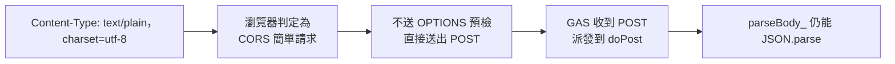
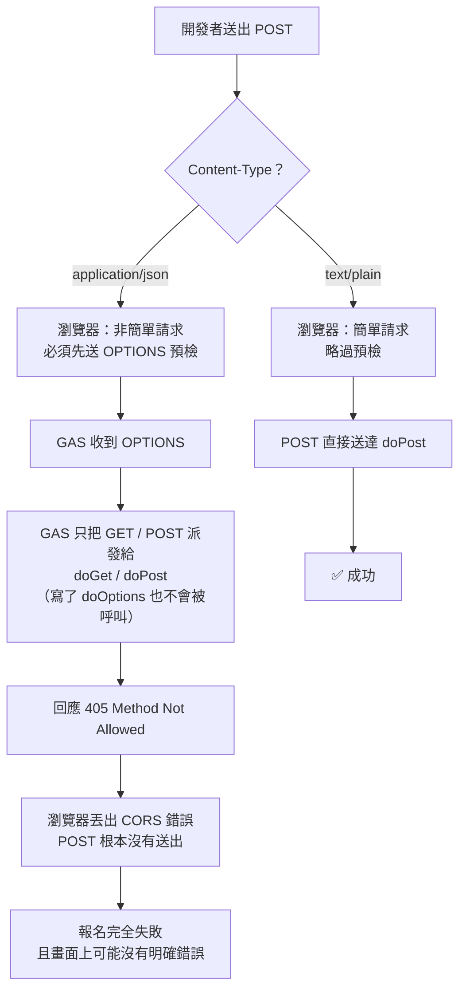
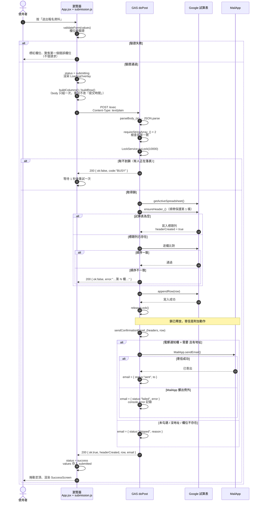
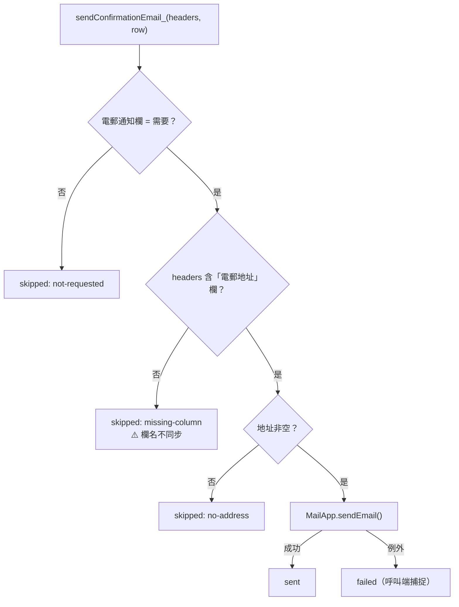
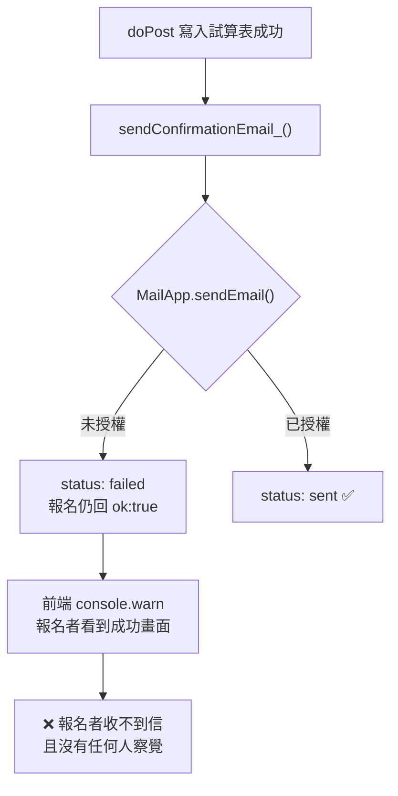
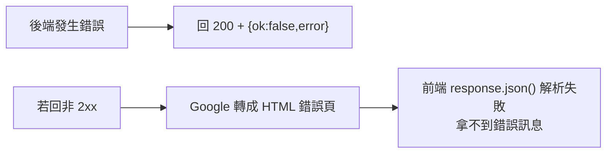
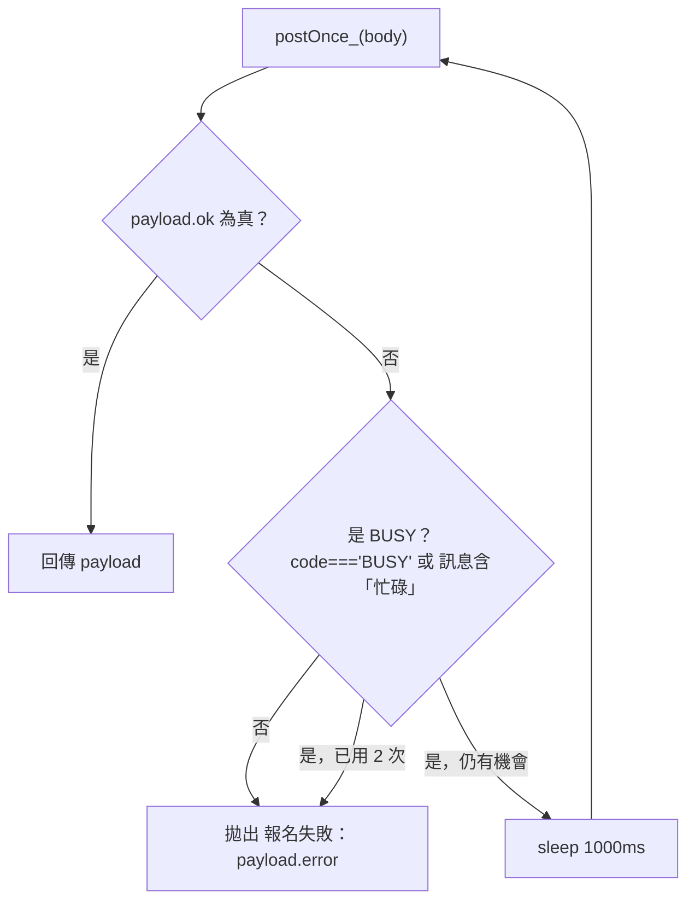
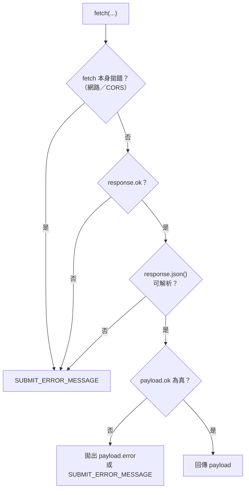
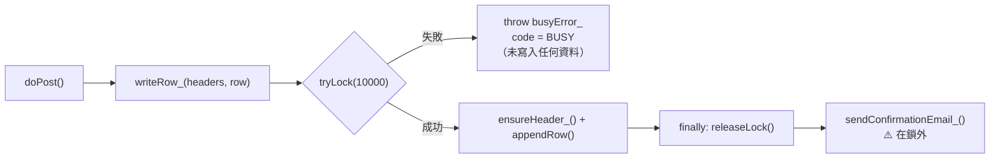
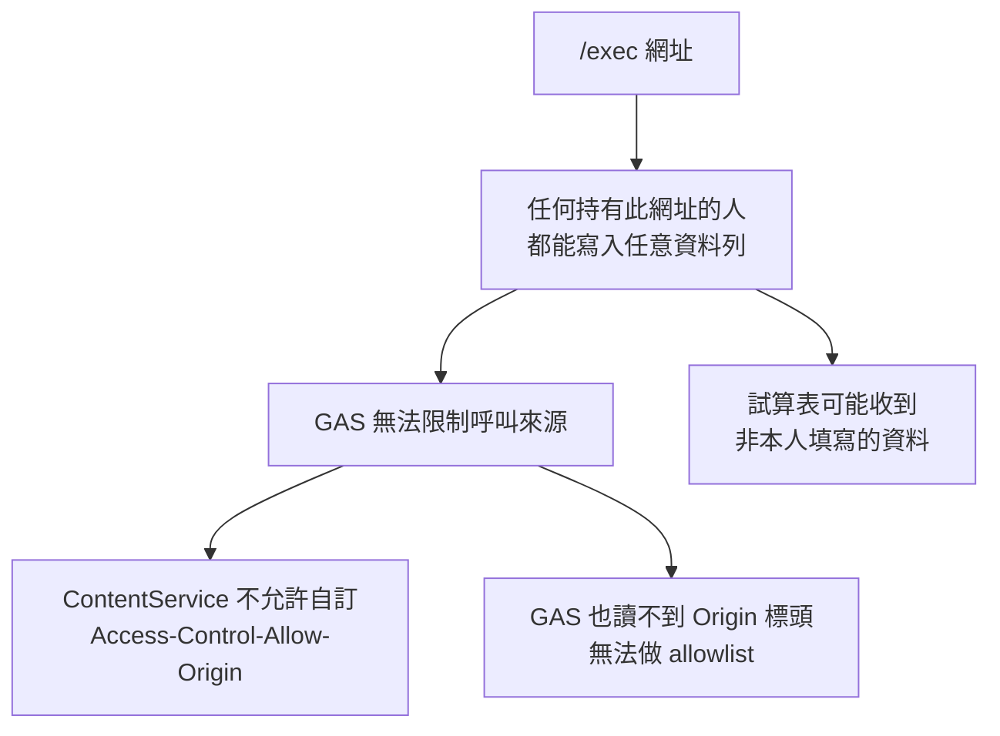

# API

後端是**一個** Google Apps Script Web App，只提供兩個端點。沒有 REST 風格的路徑，兩者都是同一個 `/exec` 網址、以 HTTP method 區分。

| Method | 用途 | 呼叫者 |
| --- | --- | --- |
| `POST` | 寫入一列報名資料 | 報名表單（正式流程） |
| `GET` | 診斷，回報試算表綁定與筆數 | 人工（開瀏覽器確認部署成功） |

## 請求格式

`POST` 的 body **是 JSON 內容，但不是 `application/json`**。這是本專案最容易踩雷的地方。



| 項目 | 值 |
| --- | --- |
| URL | GAS Web App 的 `/exec` 網址（由 `VITE_GAS_API_URL` 注入） |
| Method | `POST` |
| `Content-Type` | `text/plain;charset=utf-8` ← **不可改成 `application/json`** |
| Body | JSON 字串，見下 |

```json
{
  "headers": ["參加者姓名", "聯絡電話", "所屬類別", "…"],
  "row":     ["陳小明", "91234567", "本堂會友", "…"]
}
```

- `headers` 是試算表的標題列，`row` 是資料列，**兩者長度必須相同**。
- 兩者的元素一律是字串（前端已把陣列與物件序列化完畢，見 [schema.md](./schema.md#值的序列化規則)）。
- `headers` 每次都完整送出，因此後端不需要在前端與後端各維護一份欄位定義。

## 為什麼 Content-Type 必須是 text/plain

這是 Google Apps Script 的**硬性限制**，不是 Coding Style 選擇。



結論：**body 內容是 JSON，但宣告的 MIME 類型是純文字。** 後端 `JSON.parse` 一樣解析得動。

## 成功路徑



成功回應：

```json
{
  "ok": true,
  "service": "otc-application-form",
  "headerCreated": false,
  "row": 12,
  "email": { "status": "sent", "to": "chan@example.com" }
}
```

| 欄位 | 意義 |
| --- | --- |
| `ok` | 前端唯一判斷成功與否的依據 |
| `service` | 服務名稱，用於確認打到正確的部署 |
| `headerCreated` | 本次是否建立了標題列（`true` 表示這是第一筆報名） |
| `row` | 寫入後的資料列數，可用於人工抽查 |
| `email.status` | `sent` 已寄出 / `skipped` 未寄（附 `reason`）/ `failed` 失敗（附 `error`） |

## 電郵確認信

`emailNotify`（電郵通知）勾「需要」且 `email` 有值時，`sendConfirmationEmail_()` 會用 `MailApp` 寄一封報名確認信給報名者本人。

內文與畫面上的「報名成功」一致，包含：報名成功訊息、**報名資料逐欄明細**、
收費截止提示（`PAYMENT_NOTICE`）、名額安排提示（`QUOTA_NOTICE`）、查詢電話。

- 明細由 `buildEmailDetails_()` **走訪標題列**產生，不是逐一 hardcode 欄位，
  所以 `formSchema.js` 加欄位時確認信會自動跟著多一列。要略過的欄位寫在
  `EMAIL_DETAIL_EXCLUDE`：目前是 `提交時間`（與收信當下重複）、`電郵通知`
  與 `電郵地址`（收件人就是那個地址，寫在信上只會多一份副本）。
- ⚠️ 確認信**不含任何圖片**。曾經用 `MailApp.sendEmail({ ..., inlineImages })`
  搭配 `` 內嵌成功圖示，結果每一封信都寄不出去 ——
  `inlineImages` 是 Gmail API 的參數，不是 `MailApp` 的，傳進去會直接拋錯
  （`下列引數無效：inlineImages`）。症狀極具欺騙性：寄信失敗被降級成不影響
  報名，所以畫面照常顯示報名成功，收件人信箱卻是空的。不要加回來。
- 同時提供 `body`（純文字）與 `htmlBody`（HTML）。多數客戶端顯示 `htmlBody`，
  純文字是給不支援 HTML 的客戶端降級用。兩者都必須涵蓋同一組提示
  （`PAYMENT_NOTICE`、`QUOTA_NOTICE`），改文案時兩個 builder 都要改。
- 所有使用者輸入都經過 `escapeHtml_()` 才插進 HTML。姓名欄若不逸出，
  一個叫 `` 的姓名就會變成寄給自己的惡意郵件。
- 收費提示是 `Code.gs` 裡的 `PAYMENT_NOTICE`，**與
  `web/src/data/event.js` 的 `paymentNotice` 是兩份獨立副本**（Apps Script
  讀不到前端檔案）。改收費日期時兩個都要改。
- 名額安排提示同理：`Code.gs` 的 `QUOTA_NOTICE` 與 `web/src/data/event.js`
  的 `quota`、`notes`、拉筋班 `highlights` 是**同一句話的四份副本**，靠人工
  同步。改名額規則時四處都要改。
- ⚠️ 兩段提示都是**軟承諾**，不是執行依據：沒有任何程式會依名額提示排序或
  拒收報名，實際由人手按提交先後處理。措辭刻意用「優先考慮」而非「優先」。



設計上的三個決定：

1. **寄信在 `appendRow` 之後。** 報名資料絕不能因為寄信問題而遺失，所以順序是「先落表、再寄信」，寄信失敗仍回 `ok: true`。
2. **寄信失敗不通知前端使用者。** `submitApplication()` 只 `console.warn`，畫面照常顯示報名成功。理由是使用者看到「失敗」很可能會重填一張表單，造成重複報名。實際收信情況要看 Apps Script 執行紀錄。
3. **信件內容寫死在後端。** `EVENT_TITLE` / `ORGANIZER_NAME` / `CONTACT_PHONE` / `CONTACT_PERSON` 是 `Code.gs` 內的常數，不從 payload 取得 —— 否則任何能打到 `/exec` 的人都能改寫寄給報名者的信件內容。

需要留意的限制：

- 寄件人就是這個 Apps Script 專案的執行身分（教堂的 Google 帳號），**無法自訂寄件網域**，報名者會看到該帳號地址。
- 每日寄信額度：一般 Gmail 帳號 100 封、Gmail Workspace 1,500 封。以本活動規模綽綽有餘。
- 欄名不同步是**靜默失敗**：`ensureHeader_()` 不會報錯（標題列本來就一致），只會導致 `skipped: missing-column`。改欄名時務必同步 `Code.gs` 的常數。

### 授權（最常見的失敗原因）

`MailApp.sendEmail()` 需要 `script.send_mail` 權限，**必須由專案擁有者親自同意一次**，無法用程式碼繞過。未授權時的症狀：

```
你沒有呼叫「MailApp.sendEmail」的權限。必要權限：
https://www.googleapis.com/auth/script.send_mail
```



**這個失敗模式特別危險**，因為寄信失敗被刻意降級成不影響報名（見上方第 2 點），所以報名完全正常、畫面顯示成功，只有收不到信。務必主動測試一次。

授權步驟（`Code.gs` 的 `testEmail()` 註解有完整版）：

1. 把 `Code.gs` 的 `TEST_RECIPIENT` 改成自己的電郵地址並儲存。
2. 編輯器「執行」→ 選 `testEmail` →「執行」。
3. 權限視窗 → 選擇自己的帳號 →「允許」。若出現「Google 尚未驗證此應用程式」→ 進階 →「前往（不安全）」。**這是 Google 對所有自訂腳本的標準警告，不是異常。**
4. 執行紀錄出現「測試信已寄出：…」即授權成功。
5. **重新部署**（部署 → 管理部署 → 編輯 → 版本：新增版本 → 部署）。只授權不重新部署，Web App 仍會以舊的權限身分執行 `doPost`。

`testEmail()` **不會**被 `/exec` 呼叫到：GAS 部署為網頁應用程式時只會把 GET / POST 派發給 `doGet` / `doPost`，所以它不會變成公開的寄信入口。

### 用 clasp 部署（取代手動貼程式碼）

手動把 `Code.gs` 貼進編輯器有兩個問題：容易貼漏（`appsscript.json` 的
`oauthScopes` 常常被忘記，那正是 0.4.1 寄不出信的原因），以及每次都要
重新部署。`clasp` 可以把「推送程式碼 + 重新部署」變成兩行指令碼。

#### 一次性設定

```bash
npm install -g @google/clasp      # 開發者機器只需裝一次
clasp login                        # 開瀏覽器授權，需本人操作
cd "2026-09-26 - 📄 NEW PAGE - Me Time 充充電報名表/gas"
cp .clasp.json.example .clasp.json # 填入 scriptId
```

`scriptId` 從哪裡拿：Apps Script 編輯器 → **專案設定** → **指令碼 ID**
（也會出現在編輯器網址 `https://script.google.com/d/<scriptId>/edit`）。

> ⚠️ **`/exec` 網址裡的是「部署 ID」，不是「指令碼 ID」，兩者不同。**
> `https://script.google.com/macros/s/AKfycb…/exec` 中間那段是部署 ID，
> 拿它去填 `scriptId` 會指向錯誤的專案。只能從編輯器的專案設定取得。

`.clasp.json` **放在 `gas/` 內**（不要放 repo 根目錄），因為活動資料夾名含
空格與 emoji，根目錄版的 `rootDir` 要帶整條含 emoji 的路徑，是已知會出問題
的組合。放在 `gas/` 內則 `rootDir` 可以省略，換活動 = 換一份 `.clasp.json`。

`.clasp.json` 本身**不含憑證**（憑證存在 `%USERPROFILE%\.clasprc.json`），
只有 scriptId 與 rootDir。本 repo 已把它加入 `.gitignore`（`.clasp.json.example`
仍進版控作為範本），換活動時複製範本填入新的 scriptId。

#### 日常部署：一支腳本

```bash
cd "2026-09-26 - 📄 NEW PAGE - Me Time 充充電報名表/gas"
./deploy.ps1 -Message "fix(gas): 移除確認信的內嵌圖片

MailApp.sendEmail 不支援 inlineImages 參數，導致每封信都寄不出去。"
```

`deploy.ps1` 依序做四件事，任何一步不符就 `exit 1`：

1. **前置檢查** — `gas/` 必須只有 `Code.gs` 一個程式檔；`.clasp.json` 的
   `scriptId` 必須等於預期的專案；部署必須仍存在於 `clasp list-deployments`；
   `web/.env.production` 的網址必須等於固定部署網址。
2. **`clasp push -f`** — 推送 `Code.gs` 與 `appsscript.json`。
3. **`clasp redeploy <部署ID> -d <說明>`** — 更新**既有**部署，`/exec` 網址不變。
4. **驗證** — 部署版本必須等於最新版本、部署 description 必須等於 `-Message`，
   且 `curl` 必須回 `ok:true`、`sheet.name` 非空、`lastColumn` 等於
   `buildColumns()` 的欄數。

只想重新部署、略過推送（例如只改了部署設定）時用 `-SkipPush`。

#### `-Message`：GAS 側的 commit 訊息

`-Message` 是**必填**的，它會成為該次 clasp deployment 的 `description`
（`clasp redeploy -d`）。格式比照 git 的 Conventional Commits，但只描述
**後端**的改動 —— 純前端的變更不需要部署，也不需要寫在這裡。

```powershell
./deploy.ps1 -Message @'
fix(gas): 修正確認信的寄信失敗

為什麼：MailApp.sendEmail 不支援 inlineImages 參數（那是 Gmail API
users.messages.send 的欄位），每封信都因此寄不出去。寄信失敗被刻意降級成
不影響報名，所以畫面照樣顯示成功，只有當事人的信箱裡什麼都沒有。
'@
```

**為什麼強制要求：** Apps Script 的 HTML 編輯畫面沒有版控，
`clasp list-deployments` 的 description 是日後唯一能回溯「這次部署改了什麼、
為什麼」的線索。`Code.gs` 沒有 git 歷史可查，忘了就真的查不到。
腳本會在部署後把 description 讀回來比對，寫不上去就 `exit 1` —— 避免
「以為有記錄、其實沒有」。

順帶一提，Clasp 網頁版（`script.google.com/home/projects/…/deployments`）在
中文介面下**完全不顯示 description**，只有 `clasp list-deployments` 看得到。

#### ⚠️ PowerShell 5.1 的兩個坑（`deploy.ps1` 專用）

1. **含中文的 `.ps1` 必須存成 UTF-8 with BOM。** 沒有 BOM 時，Windows
   PowerShell 5.1 會用 ANSI 解讀整個檔案，中文的位元組被解成亂碼；若剛好落在
   here-string 裡，會直接變成**語法錯誤**（`相鄰字串沒有終止字元`）而整支腳本
   跑不起來。
2. **必須設 `[Console]::OutputEncoding = [Text.Encoding]::UTF8`。** `clasp` 是
   Node CLI，stdout 一律 UTF-8；5.1 預設用主控台碼頁（本機是 Big5）解讀它，
   中文變成替代字元，接著 `ConvertFrom-Json` 就因字串損壞而失敗。症狀極具
   欺騙性：**部署其實成功了，卻在驗證步驟報錯**，看起來像部署壞掉。

```powershell
# 檢查 BOM 是否還在
(Get-Content deploy.ps1 -Encoding Byte -TotalCount 3) -join ','   # 應為 239,187,191
```

#### 固定部署，不再新增

本專案的部署 ID 已固定，**不再建立新的部署**：

```
AKfycbxeTyNNKooo3xmG3CsdpBhULnMiduMz8ozAdwQ1glai7XnBGGlN82DPwBDwbv-i1PmX
```

`deploy.ps1` 把它寫在常數裡，**永遠不會自行建立部署**。若這個部署消失，
腳本會直接報錯停止 —— 請在 Apps Script 編輯器手動重建部署，再同步更新
`web/.env.production` 與 `deploy.ps1` 的常數。`@4 - Good`
（`AKfycbwLzq…`）保留為不更動的備援部署。

#### ⚠️ 絕對不要用 `-V` 部署到固定版本

`clasp redeploy <id> -V <版本>` 會把部署**釘死在該版本**，之後每次 push 的
新程式碼都不會上線，而且沒有任何錯誤。實測：目標部署當時在 `@6`、最新版本
是 `@10`，若下 `redeploy -V 6` 就會永遠停在舊碼。

`clasp redeploy <id>` **不帶 `-V`** 才是「部署最新版本」，也是 `deploy.ps1`
的行為。`clasp --help` 對 `redeploy` 的說明是 "Updates a deployment for a
project to a **new** version" —— 新的，不是任選某個舊的。

同理**不要**用 `clasp deploy -V <版本> -i <部署ID>`。`clasp deploy` 是
`create-deployment` 的別名，帶上 `-i` 去更新既有部署是未經文件支援的組合。
本次事故就是這樣**永久刪掉了原本的部署**（詳見下方事故記錄）。

#### 🔴 事故記錄：重複檔案讓整個專案編譯失敗

`clasp show-file-status` 曾列出第三個檔案 `程式碼.js` —— 那是 Apps Script
在中文介面自動產生的預設檔名（「程式碼」＝ Code），內容與 `Code.gs`
**完全相同**。`clasp push` 把兩份都送上去之後：

```
SyntaxError: Identifier 'SERVICE_NAME' has already been declared
```

兩個檔案都在頂端宣告 `const SERVICE_NAME`，整個專案編譯失敗，`doGet` 與
`doPost` 一起死掉，**畫面照常顯示報名成功但後端什麼都沒寫入**。

**教訓：`clasp show-file-status` 的輸出必須在 push 之前讀**，不能 push 完才看。
現在由兩道機制擋住：

- `deploy.ps1` 開頭就檢查 `gas/` 只能有 `Code.gs` 一個程式檔，多一個就中止。
- `gas/.claspignore` 以白名單鎖定只推送 `Code.gs` 與 `appsscript.json`。

若真的發生了，正確修法是**在本機**刪掉重複檔再 `clasp push -f`（讓本機與
遠端一致），**不要**在 Apps Script 編輯器裡手動刪檔 —— 那會讓本機與遠端
再次分歧，下一次 push 又會把它送回去。

#### ⚠️ `clasp push` 會覆寫並刪除遠端檔案

`clasp push` 是**單向覆寫**：遠端有、本機沒有的檔案會被刪除。所以在
Apps Script 編輯器手動改過 `Code.gs`（例如把 `TEST_RECIPIENT` 換成自己的
電郵）之後再 `clasp push`，**那個改動會被本機版本蓋掉**，
`TEST_RECIPIENT` 會回到 placeholder。

正確做法：所有後端改動都改 repo 裡的 `gas/Code.gs`，再 `clasp push`，
不要在編輯器直接改。`clasp show-file-status` 可以在推送前確認差異。

授權（OAuth consent）是綁在「專案 + 帳號」上，不綁部署，所以**授權過一次
之後，之後的 `clasp push` / `clasp deploy` 都不需要再授權**。但改了程式碼
仍然需要重新部署才會生效。

#### 自動化不含在 CI

`deploy.ps1` 只能在本機跑：`clasp` 的 OAuth 需要瀏覽器授權，GitHub Actions
拿不到。`.github/workflows/deploy_github_pages.yml` 只負責前端。
**GAS 部署 → 驗證 → 再 commit**，順序不要顛倒：先確定後端活著，再把網址
進版控。

### 宣告的權限

`gas/appsscript.json` 的 `oauthScopes` 明確宣告兩個最小權限：

| Scope | 用途 |
| --- | --- |
| `https://www.googleapis.com/auth/spreadsheets.currentonly` | 讀寫**本專案附加的**試算表（容器綁定腳本的最窄範圍） |
| `https://www.googleapis.com/auth/script.send_mail` | `MailApp.sendEmail()` 寄信 |

- 必須**全部列出**：一旦宣告 `oauthScopes`，Apps Script 就停止自動推斷，漏寫的權限會在執行時才報錯。
- 刻意**不用** `gmail.send`（可寄信但同時涵蓋草稿、標籤等更廣範圍），也**不用** `GmailApp`（它需要 `gmail.send`）。`MailApp` + `script.send_mail` 是最小權限組合。

## 失敗語意

`Code.gs` **永遠回傳 HTTP 200**，失敗以 body 的 `ok: false` 表示。



這是刻意的：Google 會把非 2xx 轉成 HTML 錯誤頁，前端就讀不到具體原因。使用者只會看到「傳送失敗」而無從排查。

常見 `error` 訊息：

| `error` 內容 | 原因 | 處理方式 |
| --- | --- | --- |
| `請求內容為空，請確認前端已正確送出表單資料。` | body 缺漏 | 檢查前端是否真的呼叫 |
| `請求內容不是合法的 JSON。` | body 不是合法 JSON | 檢查是否被中間層改寫 |
| `headers 不可為空` | 送出空標題列 | `formSchema` 的 `column` 被清空 |
| `欄位數量與資料列不符（headers N 欄，row M 欄）` | 前後端不一致 | 通常代表 `buildColumns` 與 `buildRow` 被改動其一 |
| `找不到綁定的試算表，請確認本專案已附加在目標試算表上。` | 不是以容器 bound 建立 | 重新用「擴充功能 → Apps Script」建立 |
| `試算表標題列與表單欄位順序不一致：第 N 欄應為「X」但目前是「Y」` | 改過 schema 但沒重建標題列 | 清空試算表或修正標題列 |
| `系統忙碌中，請稍後再提交。` | 取不到落表鎖（有人正在寫入） | **暫時性**，前端已自動重試一次；連續出現就看 Apps Script 執行紀錄 |

失敗回應多了一個 `code` 欄位，目前只有 `BUSY` 一個值：

```json
{ "ok": false, "code": "BUSY", "error": "系統忙碌中，請稍後再提交。" }
```

- `code` 讓前端分辨「值得重試」與「重試也沒用」。沒有 `code` 的錯誤全部不重試。
- ⚠️ `BUSY` **只在完全沒有寫入任何資料時**回傳（`tryLock` 失敗發生在 `appendRow` 之前），所以前端重試不會產生重複列。這是 `writeRow_()` 與前端重試之間的隱含約定：若日後把 `BUSY` 改成寫入之後才回，重試就會造出重複報名。
- 反過來，**網絡層的失敗（fetch 拋錯、非 2xx、回應非 JSON）一律不重試**：那種情況下後端可能已經寫入了，重試只會多一行。重複報名的風險高於讓使用者自己再撳一次。

### 前端重試路徑

`submitApplication()` 在 `BUSY` 時等 1 秒重試一次（上限兩次嘗試），其餘錯誤照舊直接拋出：



兩個細節：

- **body 只組一次**，重試送的是同一份 payload，所以「提交時間」欄不會因為重試而改變，試算表上看到的就是使用者按下去的時間。
- `isBusy_()` 用 `code === 'BUSY' || 訊息含「忙碌」` 兩個條件取 OR。任一邊被改壞都還有另一邊守住 —— 重試若靜靜失效**不會報錯**，只是使用者平白見到一次紅字再去撳一次，這類沒有症狀的退化正是要防的東西。

前端 `submitApplication()` 的四層防護（外層再套一個 `BUSY` 重試迴圈，見上節）：



`SUBMIT_ERROR_MESSAGE` 是一般化訊息（`config.js`）；只有後端明確回傳 `error` 時才顯示具體原因。

## 並行寫入與標題列保護

兩個機制處理不同的失敗模式，寫在同一個 `writeRow_()` 裡。

### 落表互斥鎖（防報名資料消失）

`ensureHeader_()` 讀 `getLastRow()`、`appendRow()` 再依位置寫入，這是 read-then-write，**Apps Script 不保證兩次呼叫之間沒有另一個執行插入**。兩個並行執行若都讀到同一個 `lastRow`，會寫進同一橫 —— 其中一筆報名**靜靜消失，但回應仍是 `ok: true`**。報名者以為報了名，名單上卻沒有他，這是本專案最不能接受的失敗型態（與「寄信是附加動作」同一個理由）。



三個不能寫錯的地方：

| 寫法 | 後果 |
| --- | --- |
| `tryLock(10000)` ✅ | 鎖只包幾百毫秒的操作，10 秒極寬鬆 |
| `waitLock()` ❌ | 無限等待。一個卡死的執行會令**之後所有報名**都逾時 —— 為防撞車而製造新故障 |
| 寄信在鎖外 ✅ | `MailApp` 可跑幾秒；由頭鎖到尾會令所有提交排隊，`tryLock` 大量超時 |
| 寄信在鎖內 ❌ | 同上，且機率更高（寄信比落表慢得多） |
| `finally` 放鎖 ✅ | 例外路徑也會放 |
| 沒有 `finally` ❌ | 一次例外就永久鎖死整個表單 |

`LockService` **不需要新增 OAuth scope**，`appsscript.json` 不必改；但 `Code.gs` 改了就要照 `deploy.ps1` 部署。

### 標題列保護（防人手改壞）

`ensureHeader_()` 逐欄比對標題列，**只要順序不對就拒絕所有寫入**。有人插入一欄、重新排序、刪掉標題列或改錯欄名，之後每一次報名都會失敗，畫面只顯示「標題列與表單欄位順序不一致」，要人手搶修。插入欄位與排序都必然觸及第 1 橫，所以 `protectHeader_()` 只保護**第 1 橫**就足以擋住這類結構性意外。

- 為什麼**不**保護整張表：`appendRow` 不碰第 1 橫，資料照樣寫得進去，因此不必依賴「擁有者可繞過保護」這個沒寫在文件裡的行為。整張表保護還會擋住人手修正個別資料。
- 為什麼**不**手動在介面設「編輯前先要求我核准」：那會令 GAS 的寫入變成「待批准變更」，等於資料根本沒入表。
- **保護失敗不會令報名失敗**：`protectHeader_()` 吞掉所有例外只記錄。保護是防手滑，不是報名的前置條件。
- 已經存在的標題列也會補上保護（自我修復），所以這份試算表建立於本機制之前、或有人手動解除過，都會在下一次報名時補回。

⚠️ 與「改 schema 後清空試算表重建標題列」這個流程的交互作用：用「選取全部 → 清除內容」清空**不會**移除第 1 橫的保護，於是重建標題列會撞上「你無法編輯這個範圍」。`unprotectHeader_()` 因此在寫入標題列前先解除任何涵蓋第 1 橫的保護（範圍型與整張表型都包括），寫完再由 `protectHeader_()` 補上。若有人在介面保護了整張表，這條路徑會把它也解除 —— 這是刻意的取捨：讓重建標題列因為權限而失敗，代價大於它避免的麻煩。

## 診斷端點

直接用瀏覽器開啟 `/exec`（會走 `GET` → `doGet`）：

```json
{
  "ok": true,
  "service": "otc-application-form",
  "sheet": { "name": "Sheet1", "lastRow": 12, "lastColumn": 16 }
}
```

用來確認三件事：部署是否上線、是否正確附加在試算表上、欄位數是否為 16。若 `sheet` 變成 `{"error": "…"}`，代表綁定有問題。`lastColumn` 應等於 [schema.md](./schema.md#試算表欄位) 的欄位總數。

## 安全限制



- 這對公開活動報名表通常可接受，但 **`/exec` 網址應視為公開資訊**，試算表不要存放敏感資料。
- 前端在送出前不做身分驗證，因此 `Code.gs` 也無法分辨「真的有人填表」與「有人用 curl 直接打」。
- 電郵欄位是新的曝露面：任何人都能寫入**任意電郵地址**。實務影響有限（只有勾「需要」時該地址才會收到一封確認信，收件者可以略過），但濫用者可以拿這個端點寄垃圾郵件給第三方。`MailApp` 的每日額度也會被消耗。
- 若需要保護，唯一可靠的作法是在前端加一個共用提交碼、並在 `doPost` 內比對（`Code.gs` 的檔頭註解有說明）。
