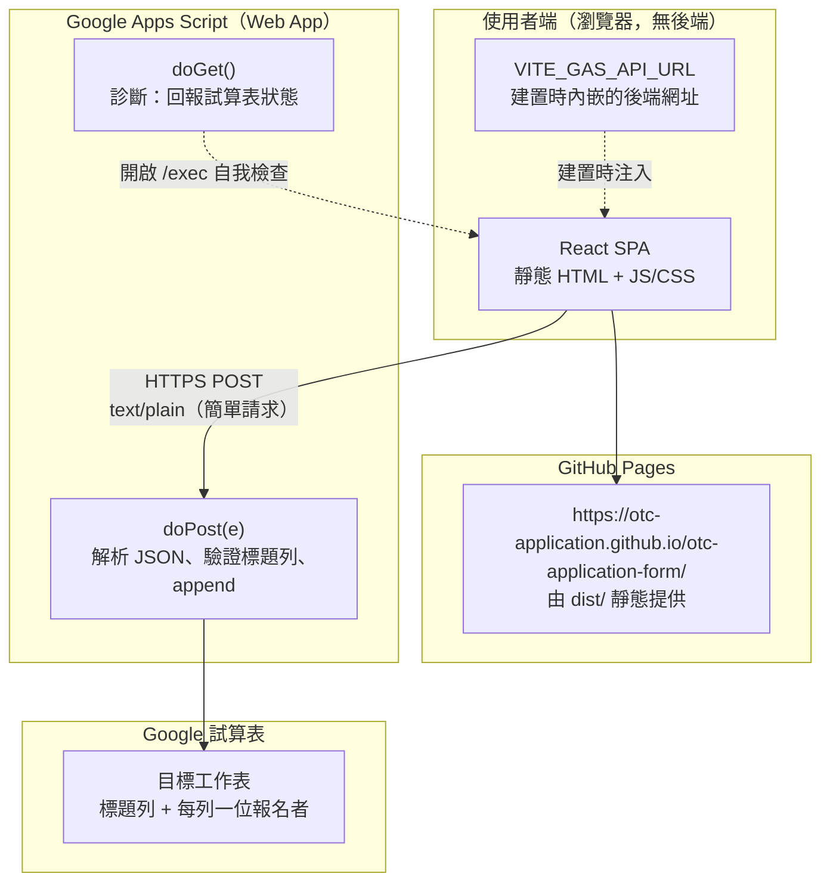
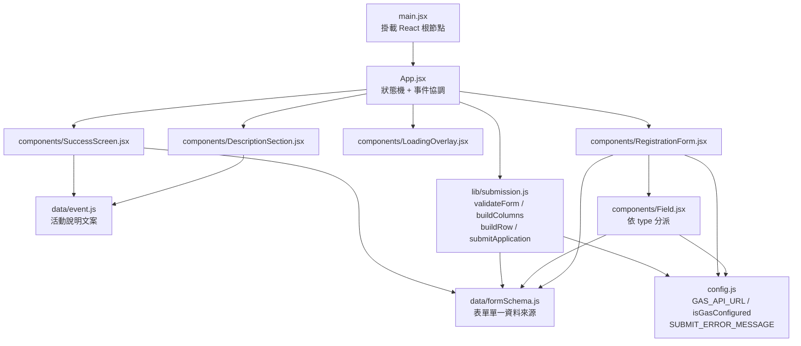
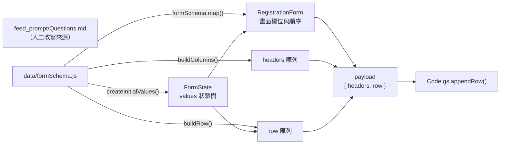
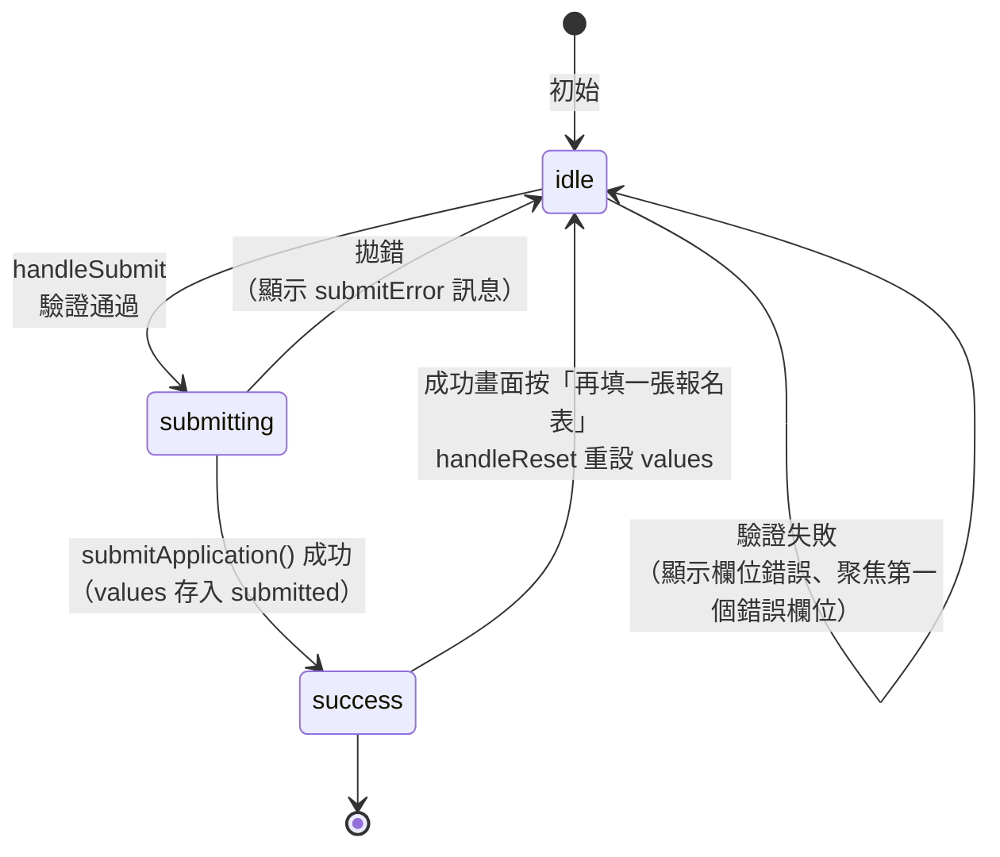
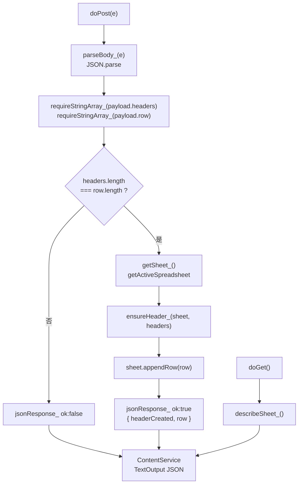
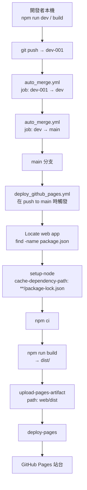

# 架構

## 高層次視圖

一句話話說：**這是一個純前端的靜態網站，把表單以跨網域 POST 送到一個 Google Apps Script Web App，由後端寫入 Google 試算表。** 網站本身沒有後端，也沒有資料庫。

### 三個關鍵特性

1. **沒有自訂後端。** 網站是純靜態檔案，GitHub Pages 就能服務；所有後端邏輯只有一個 GAS 專案。
2. **資料不經過任何自架伺服器。** 報名資料從瀏覽器直接進到 Google 試算表。
3. **後端網址在建置時決定。** `VITE_GAS_API_URL` 由 `web/src/config.js` 在 build 時內嵌成字串，因此換後端不需要改任何元件。

## 前端模組地圖

`Field.jsx` 內部以 `switch (field.type)` 分派到五個渲染器（`TextField` / `RadioField` / `CheckboxGroupField` / `ChildrenField`）。版面元件是**泛用**的：不認識「愛荃堂」或「拉筋班」，只認得 `type`。

## 資料流：一份 schema，兩個用途

這是整個專案最重要的設計：**同一份 `formSchema` 同時產生畫面欄位與試算表欄位**，兩邊不可能不同步。

- **畫面**：`RegistrationForm` 直接迭代 `formSchema`，並用 `index + 1` 當題號，所以畫面題號與 `Questions.md` 的編號一致。
- **資料**：`buildColumns()` 產生標題列，`buildRow()` 產生同長度的資料列，兩者由同一個 schema 推導，長度必然一致。

細節見 [schema.md](./schema.md)。

## App 狀態機

`App.jsx` 只有三個狀態，畫面行為完全由 `status` 決定。

兩種失敗的處理方式刻意不同：

- **驗證失敗**（前端，欄位級）：不發請求，標紅欄位並把焦點移到第一個錯誤欄位，方便手機使用者直接修正。
- **送出失敗**（網路／後端，訊息級）：回到 `idle`，在表單上方顯示紅色 alert，保留使用者已填的內容。

`status === 'success'` 時，`DescriptionSection` 仍會渲染（保留活動資訊供對照），只有表單區被換成 `SuccessScreen`。

## GAS 後端結構

`Code.gs` 使用 ES5 語法（`var` / `function`）而非 `const` / arrow，這是 Apps Script V8 環境下的保守寫法，可避免編輯器與執行環境的解析差異。

## 建置與部署流程

需要注意的幾件事：

- **本專案不在 repo 根目錄**，在活動資料夾內的 `web/`。`Locate web app` 步驟用 `find` 動態搜尋，所以換活動資料夾不需要改 workflow。
- **定位腳本不可用 `xargs`**：活動資料夾名含空格與 emoji，`xargs` 會依空白切斷路徑，導致寫入 `$GITHUB_OUTPUT` 的內容變成多行而失敗。改用 `dir=${path%/*}`。
- **後端網址在建置時決定**：`npm run build` 會把 `VITE_GAS_API_URL` 內嵌進 bundle，來源是 repo 內已提交的 `web/.env.production`。workflow 沒有注入任何環境變數，**完全依賴這個檔案**。若它缺失，線上表單會顯示「網上報名暫未開放」且送出鈕停用 —— 而本機因為有 `.env.local` 不會發現。
- **Vite 載入優先順序**：`web/.env.production`（已提交）→ `web/.env.local`（gitignored，本機覆寫）。`npm run dev` 不讀 `.env.production`，只讀 `.env` / `.env.local`。
- Agent 永遠不直接推 `dev` / `main`；`main` 由 auto-merge 推進，因此**每次 auto-merge 都會觸發一次部署**。
- 需要 repo secret `GIT_PUSH_TOKEN`（fine-grained PAT，Contents: Read and write）。用 `GITHUB_TOKEN` 無法觸發後續 workflow，串接就會斷掉。

## 技術選型

| 項目 | 選擇 | 理由 |
| --- | --- | --- |
| 建置工具 | Vite 7 | 啟動快、`base` 可設子路徑以支援 GitHub Pages |
| UI | React 19 | `PROMPT.md` 指定 |
| 樣式 | Tailwind CSS v4 | `PROMPT.md` 指定；v4 以 `@tailwindcss/vite` 外掛整合，不需 postcss 設定 |
| 狀態管理 | React `useState` | 表單只有一份扁平狀態樹，不需要 Redux 等額外依賴 |
| 狀態樹來源 | `createInitialValues(schema)` | 初始值由 schema 推導，新增欄位不需手動補初始值 |
| 後端 | Google Apps Script | `PROMPT.md` 指定；免費、無需維護伺服器 |
| 部署 | GitHub Pages + Actions | `PROMPT.md` 指定 |

`package.json` 沒有任何表單或 UI 函式庫：表單渲染、驗證、序列化全部是這個專案自己寫的，因為需求（條件式欄位、逐場次多名子女、欄位順序等同試算表欄位）相當特定，通用函式庫反而要額外遷就。
