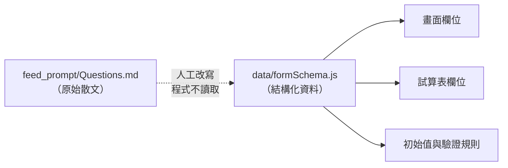
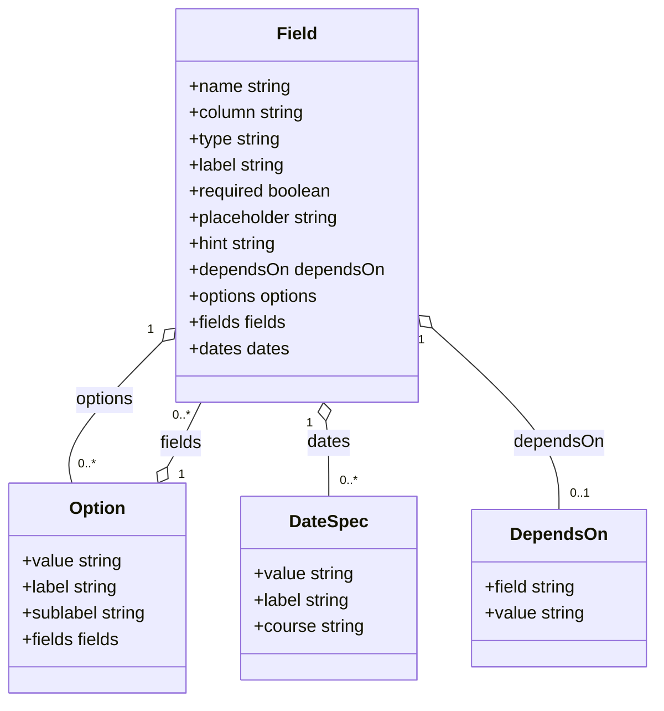
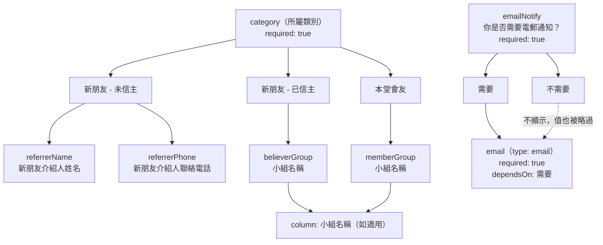
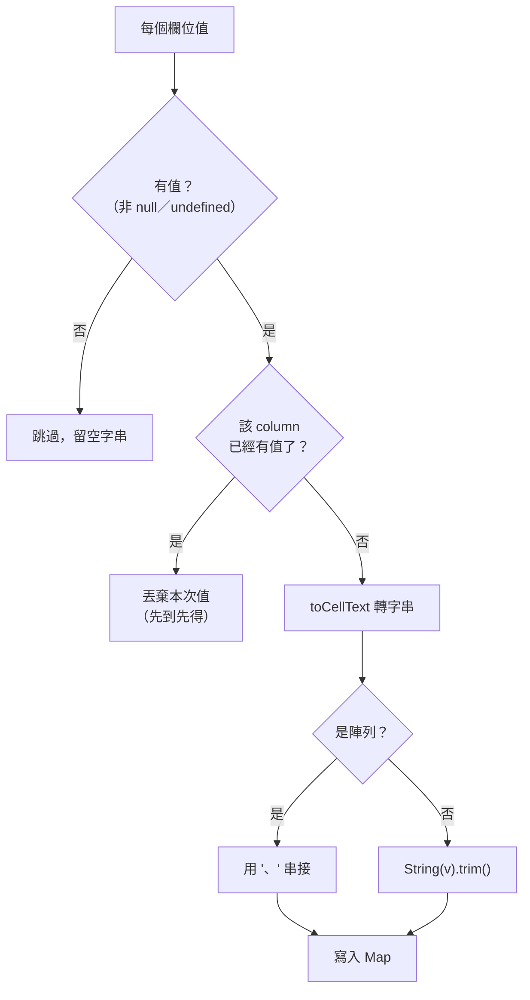
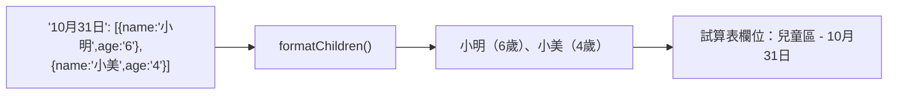
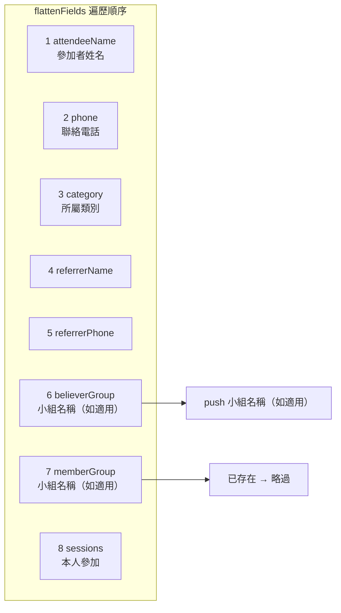
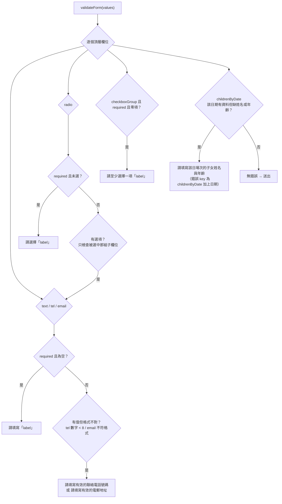
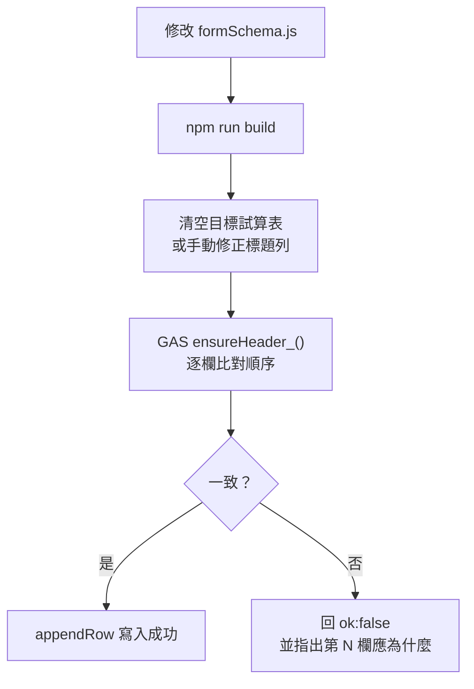

# 表單 Schema

`web/src/data/formSchema.js` 是整個專案的**單一資料來源**。它同時決定：

1. 畫面上的欄位與順序
2. 送到 Google 試算表的欄位（`column`）與順序

兩者不可能不同步，因為它們是同一份資料的兩種投影。

## 內容來源與程式資料的對應

`feed_prompt/` 是 `PROMPT.md` 指定的原始文案，**沒有任何程式讀取它**。要換內容，請人工改寫成 `web/src/data/` 內的結構化資料：

| 原始來源 | 對應程式檔 | 影響範圍 |
| --- | --- | --- |
| `feed_prompt/Description.md` | `web/src/data/event.js` | 頂部活動說明區、成功畫面 |
| `feed_prompt/Questions.md` | `web/src/data/formSchema.js` | **整張表單與試算表所有欄位** |



`web/src/components/` 下的版面元件是**泛用渲染器**，只認得 `type`，不知道「愛荃堂」「拉筋班」等活動名詞。正常情況下**不需要修改元件**；換活動只改 `data/` 與 `gas/`。

## Schema 節點結構



| 屬性 | 型別 | 用途 |
| --- | --- | --- |
| `name` | string | **狀態樹的 key**，也是 payload 的來源。不可與其他欄位重複 |
| `column` | string | 試算表標題列文字。省略或空字串表示不寫入試算表 |
| `type` | string | 決定 `Field.jsx` 用哪個渲染器，並影響驗證方式 |
| `label` | string | 畫面上的欄位標題與題號文字 |
| `required` | boolean | 是否必填 |
| `placeholder` | string | 輸入框提示文字 |
| `hint` | string | 欄位下方的說明文字 |
| `dependsOn` | DependsOn | **條件式子欄位**專用：父欄位必須是某個值才送出，見下 |
| `options` | Option[] | `radio` / `checkboxGroup` 的選項 |
| `fields` | Field[] | 該選項被選中時才顯示的**條件式子欄位** |
| `dates` | DateSpec[] | `childrenByDate` 專用：逐場次的日期規格 |

### 條件式子欄位的 dependsOn

`radio` 選項底下的子欄位會永遠存在於狀態樹中，因此**使用者改選另一個選項後，先前輸入的值不會自動消失**。對「介紹人姓名」這類欄位無所謂（錯的值等於沒填），但對「電郵地址」就有問題：勾「需要」、輸入地址、再改選「不需要」，若照樣送出，試算表就會留下一個沒人同意接收的地址。

`dependsOn` 讓這個規則寫在欄位自己身上，而不是散落在 `submission.js`：

```js
{ name: 'email', column: '電郵地址', type: 'email', required: true,
  dependsOn: { field: 'emailNotify', value: EMAIL_CONSENT.yes } }
```

`buildRow()` 遇到有 `dependsOn` 且父欄位不符的欄位會**直接略過**，該欄在試算表留空。父欄位未選（空字串）視為不符。

### 選項（Option）

| 屬性 | 用途 |
| --- | --- |
| `value` | 寫入 `FormState` 的值（也是寫進試算表的值） |
| `label` | 畫面上的選項文字 |
| `sublabel` | 選項下方的次要說明（如場次名稱），僅 `checkboxGroup` 顯示 |
| `fields` | 選中此項時追加渲染的子欄位；`radio` 一次只顯示一組 |

### 日期規格（DateSpec）

| 屬性 | 用途 |
| --- | --- |
| `value` | 試算表欄位名的後半段，如 `10月31日`；也是 `FormState` 的 key |
| `label` | 畫面顯示用，如 `10 月 31 日（六）` |
| `course` | 該場次的活動名稱，顯示為選項次要說明 |

`sessionDates` 這一個常數被**兩處**重用：`sessions`（本人參加）的選項來源，以及 `childrenByDate` 的日期來源。改場次只需改這一處。

## 欄位型別

`Field.jsx` 以 `switch (field.type)` 分派：

| `type` | 渲染器 | 值的形狀 | 試算表呈現 |
| --- | --- | --- | --- |
| `text` | 單行文字 | `string` | 原字串 |
| `tel` | 電話輸入（`inputMode="tel"`） | `string` | 原字串 |
| `email` | 電郵輸入（`inputMode="email"`） | `string` | 原字串 |
| `radio` | 單選卡片 | `string` | 選項 `value` |
| `checkboxGroup` | 多選卡片 | `string[]` | 以 `、` 串接 |
| `childrenByDate` | 逐場次子女清單 | `Record<string, {name,age}[]>` | 每個日期一欄，見下 |

`Field.jsx` 的 `TextField` 以 `INPUT_ATTRS` 對照表決定原生的 `type` / `inputMode` / `autoComplete`；不在表內的型別（`text`）走預設值。

## 條件式欄位

`category`（所屬類別）與 `emailNotify`（你是否需要電郵通知？）的選項各自帶一組子欄位，選到哪組就顯示哪組。



關鍵行為：

- **子欄位永遠存在於狀態樹中**，即使未顯示；`createInitialValues()` 會為所有欄位建立初始值。未顯示的子欄位送出時為空字串，因此試算表欄位固定 16 欄，不會因為使用者選了哪一類而變動。
- **切換選項不會清除另一組的已填值**。因為 `believerGroup` 與 `memberGroup` 是兩個獨立的 key、共用一個 `column`，`buildRow()` 的「先到先得」規則決定了**外觀順序較前**的欄位勝出（見下）。電郵地址則由 `dependsOn` 處理：`emailNotify` 不是「需要」時該欄被略過，**不會**在試算表留下無人同意接收的地址。
- `referrerName` / `referrerPhone` / `believerGroup` / `memberGroup` 都**沒有** `required`，因此驗證時不會被檢查。畫面上以「（如適用）」標示。
- `email` **有** `required: true`，但只在 `emailNotify === '需要'` 時才檢查（`validateForm()` 只檢查被選中選項的子欄位）。`emailNotify` 本身 `required: true`，不選會擋下送出（`請選擇「你是否需要電郵通知？」`）；選「不需要」時整組通過，電郵地址留空。

## FormState 資料形狀

`createInitialValues(schema)` 產生的初始狀態：

```js
{
  attendeeName: '',
  phone: '',
  category: '',
  referrerName: '',            // 條件式子欄位，未顯示也有 key
  referrerPhone: '',
  believerGroup: '',
  memberGroup: '',
  sessions: [],                 // checkboxGroup → 陣列
  childrenByDate: {            // childrenByDate → 以日期為 key 的物件
    '10月31日': [],
    '11月7日':   [],
    '11月21日':  [],
    '11月28日':  [],
    '12月5日':   [],
    '12月12日':  [],
  },
  emailNotify: '',             // radio → '' 代表未選
  email: '',                   // dependsOn: emailNotify === '需要'
}
```

每筆子女是 `{ name: string, age: string }`（年齡為字串，可填分數）。

## 值的序列化規則

`buildRow()` 透過 `setCell(column, text)` 逐欄填值，規則如下。



三條規則：

1. **先到先得（first non-empty wins）。** `setCell` 遇到已填入的 `column` 就直接丟棄。由於遍歷順序是外觀順序（`believerGroup` 在 `memberGroup` 之前），結果是**小組名稱永遠取 `believerGroup` 的值**。若 `believerGroup` 為空而 `memberGroup` 有值，則填入 `memberGroup` 的值 —— 這個 fallback 是刻意保留的實用行為。
2. **陣列以 `、` 串接。** `sessions` 因此變成 `10月31日、11月7日`。
3. **空值一律寫成空字串 `''`**，不用 `null`，避免試算表出現 `null` 文字。

### 兒童區格式

`formatChildren()` 把每位子女渲染為 `姓名（年齡歲）`，同日期多人以 `、` 分隔；年齡留空時只輸出姓名。



### 提交時間

`提交時間` 是**唯一不由 schema 產生**的欄位，由 `buildColumns()` 在最後 `push` 進去，格式為 `YYYY-MM-DD HH:mm`。

- 使用**瀏覽器所在時區**的本地時間（`getFullYear` / `getHours` 等本地 getter），分鐘精度、不含秒。
- 這是 `gas/appsscript.json` 的 `timeZone` 設定對本專案無影響的原因：後端完全沒有產生或格式化時間。

## 試算表欄位

`buildColumns()` 產出 **16 欄**，順序即 `Questions.md` 的問題順序，也與畫面上的欄位順序完全一致（`childrenByDate` 沒有自己的 `column`，它的每一個日期緊接在該欄位之後展開）：

| # | 標題列 | 來源欄位 | 值的形狀 |
| --- | --- | --- | --- |
| 1 | `參加者姓名` | `attendeeName` | 姓名 |
| 2 | `聯絡電話` | `phone` | 電話號碼 |
| 3 | `所屬類別` | `category` | 選項 value |
| 4 | `新朋友介紹人姓名（如適用）` | `referrerName` | 姓名或空 |
| 5 | `新朋友介紹人聯絡電話（如適用）` | `referrerPhone` | 電話或空 |
| 6 | `小組名稱（如適用）` | `believerGroup` / `memberGroup` | 小組名稱 |
| 7 | `本人參加` | `sessions` | `10月31日、11月7日` |
| 8 | `兒童區 - 10月31日` | `childrenByDate['10月31日']` | `小明（6歲）、小美（4歲）` |
| 9 | `兒童區 - 11月7日` | `childrenByDate['11月7日']` | 同上 |
| 10 | `兒童區 - 11月21日` | `childrenByDate['11月21日']` | 同上 |
| 11 | `兒童區 - 11月28日` | `childrenByDate['11月28日']` | 同上 |
| 12 | `兒童區 - 12月5日` | `childrenByDate['12月5日']` | 同上 |
| 13 | `兒童區 - 12月12日` | `childrenByDate['12月12日']` | 同上 |
| 14 | `電郵通知` | `emailNotify` | `需要` / `不需要` / 空 |
| 15 | `電郵地址` | `email` | 電郵地址，未勾「需要」時為空 |
| 16 | `提交時間` | 後端自動產生 | `2026-09-26 14:03` |

兒童區欄位名由 `childrenColumnPrefix`（`'兒童區 - '`）與 `DateSpec.value` 拼接而成，所以新增場次會自動多一欄。

### 電郵兩欄與 GAS 的連動

第 14、15 欄的**欄名與選項值**同時被 GAS 用來決定要不要寄信，因此前後端必須一致：

| 前端 | 後端 | 不一致時的症狀 |
| --- | --- | --- |
| `column: '電郵通知'` | `EMAIL_NOTIFY_COLUMN` | 該欄不被辨識，永遠不寄信 |
| `column: '電郵地址'` | `EMAIL_ADDRESS_COLUMN` | 同上 |
| `EMAIL_CONSENT.yes`（`需要`） | `EMAIL_CONSENT_YES` | 勾了「需要」仍不寄信 |

**症狀是靜默的**：欄名不一致不會讓 `ensureHeader_()` 報錯（標題列本來就一致），只會導致 `sendConfirmationEmail_()` 回 `skipped: 'missing-column'`。要察覺只能看 Apps Script 執行紀錄。

### 共用 column 的去重

`believerGroup` 與 `memberGroup` 的 `column` 都是 `小組名稱（如適用）`。`buildColumns()` 用 `if (!columns.includes(...))` 去重，因此**只佔一欄，位置取外觀順序較前者**（第 6 欄）。



## 驗證規則

`validateForm(values)` 回傳 `{ fieldName: 錯誤訊息 }`，空物件代表通過。遍歷頂層欄位，遇到 `radio` 被選中時會**再檢查該選項底下的條件式子欄位**。

| `type` | 規則 | 訊息 |
| --- | --- | --- |
| `text` | `required` 時不可為空（trim 後） | `請填寫「<label>」` |
| `tel` | 同上；且**有值時**數字字元須 ≥ 8 | `請填寫有效的聯絡電話號碼` |
| `email` | 同上；且**有值時**須符合 `EMAIL_PATTERN` | `請填寫有效的電郵地址` |
| `radio` | `required` 時不可為空 | `請選擇「<label>」` |
| `checkboxGroup` | `required` 時至少選一項 | `請至少選擇一項「<label>」` |
| `childrenByDate` | 某日期**有列資料**時，每筆的姓名與年齡都不可為空 | `請填寫<date.label>的子女姓名與年齡` |



兩個刻意的寬鬆設計：

- **兒童區**該日期完全沒填資料是允許的（`list.length === 0` 直接 `continue`），只有「填了一半」才報錯。錯誤訊息中含 `（六）` 等括號內容，來自 `date.label`。
- **電郵地址**只在勾「需要」時才要求填寫且須符合格式；選「不需要」時即使狀態樹裡還留著先前輸入的地址，`buildRow()` 也會依 `dependsOn` 略過，該欄在試算表留空。`EMAIL_PATTERN` 是刻意簡化的實用檢查，不追求完整 RFC。

## 修改 schema 的注意事項



- **順序絕對不能錯。** GAS 的 `appendRow` 是位置式寫入，欄位錯序**不會報錯，只會靜默寫進錯誤的欄**。這正是 `ensureHeader_()` 逐欄比對、順序不符即拒絕寫入的原因 —— 寧可報名失敗，也不要資料寫錯欄。
- **改完必須清空試算表或重建標題列。** 只改 schema 而不合頭，會從下一筆報名開始全部被拒絕。
- **驗證 payload**（schema 改動後）：

  在 `web/` 目錄下執行：

  ```bash
  node -e "import('./src/lib/submission.js').then(m => { const c = m.buildColumns(); console.log('count:', c.length); console.log(c); const r = m.buildRow(m.createInitialValues()); console.log('row length:', r.length); console.log('row:', JSON.stringify(r)); })"
  ```

  `submission.js` 刻意使用 `import.meta.env?.` 與 `export`，因此可以在純 Node 下 `import`，不必先跑 Vite。空表單應印出 `count: 16` 與 `row length: 16`，且整列除了最後一欄 `提交時間` 外全為空字串。

  用真實值驗證序列化（可貼上整段執行）：

  ```bash
  node -e "import('./src/lib/submission.js').then(m => { const v = m.createInitialValues(); v.attendeeName = '陳小明'; v.phone = '91234567'; v.category = '本堂會友'; v.memberGroup = '長洲組'; v.sessions = ['10月31日','11月7日']; v.childrenByDate['10月31日'] = [{name:'小明',age:'6'},{name:'小美',age:'4'}]; v.emailNotify = '需要'; v.email = 'chan@example.com'; console.log(m.buildRow(v)); console.log(JSON.stringify(m.validateForm(v))); })"
  ```

  應得到 `['陳小明','91234567','本堂會友','','','長洲組','10月31日、11月7日','小明（6歲）、小美（4歲）','','','','','','需要','chan@example.com','<時間戳>']` 與空物件 `{}`。兩點值得留意：第 6 欄的小組名稱來自 `memberGroup`，證明共用 `column` 的 fallback 行為可用；第 15 欄的電郵地址有值，代表 `dependsOn` 判定通過。

  驗證 `dependsOn` 會擋下殘留值（**電郵功能的核心行為**）：

  ```bash
  node -e "import('./src/lib/submission.js').then(m => { const c = m.buildColumns(); const i = c.indexOf('電郵地址'); const v = m.createInitialValues(); v.emailNotify = '需要'; v.email = 'chan@example.com'; v.emailNotify = '不需要'; console.log('電郵地址欄:', JSON.stringify(m.buildRow(v)[i])); console.log('errors:', JSON.stringify(m.validateForm(v))); })"
  ```

  應印出 `電郵地址欄: ""` 與 `errors: {}` —— 使用者改選「不需要」後，剛才輸入的地址不會寫入試算表。

## 已知問題

- `formSchema.js` 最後匯出的 `requiredMessage(label)` **目前沒有任何呼叫者**。`validateForm()` 內以樣板字串各自產生相同文字（`請填寫「${label}」`），等於有兩份相同字串。建議讓 `validateForm()` 改用這個 helper，或直接移除匯出，避免日後修改訊息時漏改一處。
